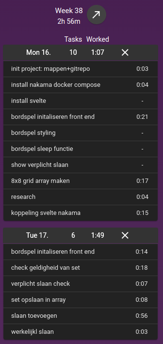

# dammen
This was a project initially started with the goal to showcase my coding skills for working as a programming coach at @bit-academy.nl.
The required tasks accomplished within the first 3 hours where (as quoted straight from the document in dutch):

1. De gebruiker moet kunnen aangeven welke steen hij
waarnaartoe verplaatst.
2. Het is verplicht om te slaan wanneer dit mogelijk is.
3. Een steen kan niet naar achteren verplaatst worden.
4. Het systeem moet enige feedback kunnen geven over de staat
van het spel. Bijvoorbeeld door het bord als een simpel grid te
tonen.

#How to locally deploy:
for version 1 nakama is not yet needed, even though it is set up.

deployment is simple:
```
git pull <this repo>
cd frontend/
npm install
npm run dev
```
now you should have the dev envoirment ready for the front end of dammen.
if you bring your browser to:
http://localhost:5173/game

you can start playing the local multiplayer version.


## Multiplayer with nakama
this will be in future release

# List of tasks done within 3 hours:


# Video documentation of 3 hours coding the game
https://edflix.nl/w/q1UCcSS4aDnK6p14Ds8aYH
